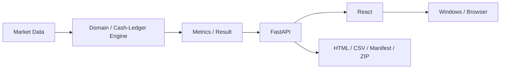

[中文](README.md) | [English](README_EN.md)

# QuantLab

> 可信、可复现的港股日线回测与研究工具，强调清晰假设与工程质量。

[](.github/workflows/ci.yml)
[](pyproject.toml)
[](docs/GOLDEN_TESTS.md)
[](pyproject.toml)
[](LICENSE)
[](CHANGELOG.md)

QuantLab 是一个面向港股日线策略研究的本地量化回测原型。项目重视执行时点、交易成本、
公司行为、账本一致性和结果复核，而不是追求夸张的收益展示。它不是实盘交易系统、荐股工具，
也不对盈利作出任何承诺。

## 界面截图

截图使用确定性的离线港股夹具生成，不包含私人信息、账户数据或实时交易数据。


## Why QuantLab? / 为什么做 QuantLab

不少回测演示会略过真正决定结果的假设：订单何时可以成交、使用哪个价格、买卖两侧是否都计费、
公司行为如何处理，以及最终报告是否与产生它的交易账本一致。

QuantLab 从一件不那么炫目、却更重要的事情开始：**先把每一笔钱算清楚**。行情、执行、指标、
API 响应、图表、交易记录和导出文件之间都有明确且可测试的边界。

## Key Features / 核心功能

- 日线、只做多或空仓的 SMA 双均线策略；T 日收盘产生信号，最早在 T+1 调整后开盘价成交。
- 港交所代码标准化与整数手数（board lot）执行。
- 透明拆分港股交易成本，包括最低佣金和法定费用。
- Open、High、Low、Close 使用一致的复权口径。
- 使用相同资金与执行纪律进行可交易基准对比。
- 确定性的行情指纹与稳定的运行标识。
- 可人工复核的 G01-G13 旧版黄金测试与 HK01-HK15 港股黄金测试。
- 类型明确的 FastAPI 后端，以及 React、TypeScript、Ant Design、ECharts 前端。
- 本地 SQLite 运行历史与可复用研究预设。
- 从同一个后端结果生成 HTML、CSV、Manifest 和统一 ZIP。
- 隔离的 Edge/Chrome 应用窗口与自包含 Windows 安装包。

## 架构



`MarketDataResult` 是行情事实来源，后端比较结果是回测会计事实来源，API 序列化结果是展示契约。
前端不会重新计算收益率、回撤、成交、交易成本或交易配对。详细说明见
[ARCHITECTURE.md](docs/ARCHITECTURE.md) 和
[FRONTEND_ARCHITECTURE.md](docs/FRONTEND_ARCHITECTURE.md)。

## Backtest Assumptions / 回测假设

- 仅使用日线；仓位只能为做多或空仓。
- T 日收盘后形成的目标仓位，最早在 T+1 日开盘执行。
- 不支持做空、杠杆、日内交易或成交量冲击模型。
- 策略与基准都显式计入交易成本和滑点。
- 港股交易使用整数手数；缺失的手数元数据需要人工确认。
- 所有价格采用统一的调整后 OHLC 口径；现金分红不会单独作为现金流入账。
- 期末未平仓持仓按最后一个调整后收盘价估值，不虚构卖出交易。

规范性规则见 [BACKTEST_SPEC.md](docs/BACKTEST_SPEC.md)；港股市场约定与费用假设见
[HK_MARKET_RULES.md](docs/HK_MARKET_RULES.md)。

## Testing / 测试体系

质量门完全离线且结果确定。黄金测试使用人工核验的固定字面预期值，不通过生产公式反向生成期望值。

- **G01-G13：** 覆盖现金账本、成交时点、成本、回撤、预热、复权和数据指纹等旧版契约。
- **HK01-HK15：** 覆盖代码、手数、资金不足、买卖侧费用、基准、交易日历、公司行为和会计守恒。
- **Python：** 353 个离线单元、契约、集成、仓库和 Windows 启动器测试。
- **前端：** 20 个单元/组件测试，以及 lint、格式、类型检查和生产构建。
- **E2E：** 6 个固定夹具桌面/移动产品流程，包括交易表内部滚动隔离。
- **Windows：** 不打开浏览器的打包 smoke test，验证固定离线港股流程、HTTP 就绪、有限退出和端口释放。

```powershell
$env:QUANTLAB_OFFLINE = "1"
.venv\Scripts\python -m ruff check .
.venv\Scripts\python -m ruff format --check .
.venv\Scripts\python -m coverage run --branch -m unittest discover -s tests
.venv\Scripts\python -m coverage report --fail-under=85

pnpm --dir frontend format:check
pnpm --dir frontend lint
pnpm --dir frontend typecheck
pnpm --dir frontend test
pnpm --dir frontend build
pnpm --dir frontend e2e
```

黄金样例细节见 [GOLDEN_TESTS.md](docs/GOLDEN_TESTS.md) 和
[HK_GOLDEN_TESTS.md](docs/HK_GOLDEN_TESTS.md)。

## Example / 固定示例

[港股固定示例（fixed Hong Kong example）](examples/hk-sma-fixed/README.md) 使用内置离线提供器，让 `0700.HK` 与可交易基准
`2800.HK` 进行比较。该示例刻意保持规模小、结果确定且便于人工复核，不代表真实历史市场表现。

仓库同时保留 QuantLab v0.1.0 固定生成（fixed at QuantLab v0.1.0）的
[SPY SMA 20/60 回归示例](examples/spy-sma-20-60/README.md)，用于保护旧版 G01-G13 契约。

## 安装

### 从源码运行

环境要求：Python 3.11 或 3.12、Node.js 和 pnpm。

```powershell
git clone <repository-url>
cd quantlab
py -3.12 -m venv .venv
.venv\Scripts\python -m pip install --require-hashes -r requirements.lock
.venv\Scripts\python -m pip install --no-build-isolation --no-deps -e .
pnpm --dir frontend install --frozen-lockfile
pnpm --dir frontend build

$env:QUANTLAB_MODE = "DESKTOP"
$env:QUANTLAB_HOST = "127.0.0.1"
$env:QUANTLAB_PORT = "8000"
.venv\Scripts\python -m quant_lab.server
```

打开 `http://127.0.0.1:8000`。

### Windows

从 GitHub Releases 下载 `QuantLab-v0.2.1-windows-x64.zip`，使用 `SHA256SUMS.txt` 校验后解压，
运行 `QuantLab\QuantLab.exe`。可执行文件尚未进行代码签名，因此 Windows SmartScreen 可能显示
“未知发布者”提示。

## 项目结构

```text
frontend/                    React 产品界面与前端测试
src/quant_lab/application/   港股工作流、序列化、导出与离线 smoke
src/quant_lab/market/hk/     港股代码、手数、费用、日历、引擎与指标
src/quant_lab/providers/     数据提供器抽象、Yahoo 适配器与确定性缓存
src/quant_lab/api/           FastAPI 路由与类型化契约
src/quant_lab/storage/       SQLite 历史、预设、设置与最近标的
packaging/windows/           桌面启动器、PyInstaller 配置、许可证与发布构建
tests/                       离线 Python 黄金、契约、集成与启动器测试
docs/                        回测规范、架构与市场规则
```

## Limitations / 已知限制

- Yahoo/yfinance 可能修订历史数据，也可能暂时不可用。
- 无法保证所有港交所证券都有正确的手数元数据，部分标的需要人工核验。
- 调整后价格模型采用数据提供器的复权结果，不单独记录现金分红。
- 当前公开研究流程只包含一种 SMA 策略，且一次只管理一个仓位。
- 不连接券商，不提交真实订单，也不支持做空或杠杆。
- Windows 可执行文件尚未签名。
- 回测结果取决于模型假设，不代表未来表现。

项目在首次公开发布后进入功能冻结状态，详见
[PROJECT_STATUS.md](docs/PROJECT_STATUS.md)。

## Disclaimer / 免责声明

QuantLab 仅用于软件工程、教育和量化研究，不构成投资建议、证券推荐或任何形式的收益保证。

## License

QuantLab 使用 [MIT License](LICENSE)。版本记录见英文 [CHANGELOG.md](CHANGELOG.md)，发布流程见
[RELEASE.md](docs/RELEASE.md)。
