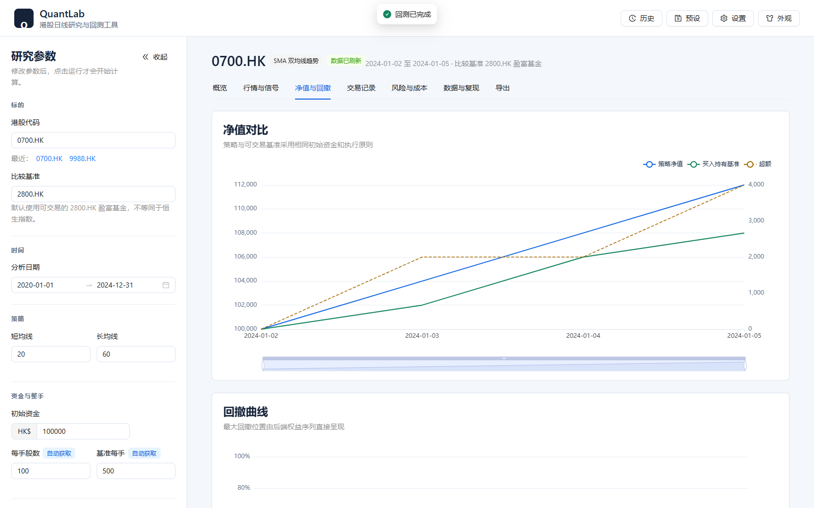
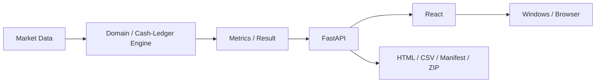

[中文](README.md) | [English](README_EN.md)

# QuantLab

> A trustworthy and reproducible daily backtesting and research tool for Hong Kong equities.

[](.github/workflows/ci.yml)
[](pyproject.toml)
[](#testing)
[](pyproject.toml)
[](LICENSE)
[](CHANGELOG.md)

QuantLab is a trustworthy and reproducible quantitative backtesting and research prototype
with Hong Kong market support. It is an engineering project for studying daily strategies,
not a live-trading system, stock picker, or promise of profitability.

## Screenshot

The screenshot uses a deterministic offline HK fixture and contains no private or live account
data.



## Why QuantLab?

Many backtest demos hide the assumptions that dominate their results: when an order can execute,
which price is used, whether costs are charged on both sides, how corporate actions are handled,
and whether the report matches the ledger that produced it.

QuantLab starts somewhere less glamorous and more useful: **account for every dollar first**.
Market data, execution, metrics, API responses, charts, trades, and exports follow explicit and
testable boundaries.

## Key Features

- Daily, long-or-cash SMA crossover with T-day signals and T+1 adjusted-open execution.
- HKEX symbol normalization and integer board-lot execution.
- Transparent Hong Kong cost breakdown, including minimum commission and statutory fees.
- Consistently adjusted Open, High, Low, and Close prices.
- Tradable benchmark comparison using the same capital and execution discipline.
- Deterministic market-data fingerprints and stable run identifiers.
- Manually auditable legacy G01-G13 and Hong Kong HK01-HK15 golden tests.
- Typed FastAPI backend with a React, TypeScript, Ant Design, and ECharts interface.
- Local SQLite history and reusable research presets.
- HTML, CSV, Manifest, and combined ZIP exports from one backend result.
- Isolated Edge/Chrome desktop window and a self-contained Windows package.

## Architecture



`MarketDataResult` is the market-fact source, the backend comparison result is the accounting
source, and API serialization is the presentation contract. The frontend never recalculates
returns, drawdowns, fills, trading costs, or trade pairing. See
[ARCHITECTURE.md](docs/ARCHITECTURE.md) and
[FRONTEND_ARCHITECTURE.md](docs/FRONTEND_ARCHITECTURE.md).

## Backtest Assumptions

- Daily bars only; long or cash only.
- A target formed after the T close can execute no earlier than the T+1 open.
- No short selling, leverage, intraday trading, or volume-impact model.
- Strategy and benchmark use explicit transaction costs and slippage.
- Hong Kong trades use integer board lots; unavailable metadata requires confirmation.
- Prices use one adjusted-OHLC policy; cash dividends are not booked as separate cash flows.
- Open positions are marked at the final adjusted close without inventing an exit.

The normative rules are in [BACKTEST_SPEC.md](docs/BACKTEST_SPEC.md); Hong Kong conventions and
fee assumptions are in [HK_MARKET_RULES.md](docs/HK_MARKET_RULES.md).

## Testing

The quality gate is deterministic and offline. Expected values are fixed literals rather than
values regenerated by production formulas.

- **G01-G13:** legacy cash-ledger, timing, cost, drawdown, warmup, adjustment, and fingerprint
  contracts.
- **HK01-HK15:** symbol, board-lot, insufficient-capital, side-aware fee, benchmark, calendar,
  company-action, and accounting-conservation contracts.
- **Python:** 353 offline unit, contract, integration, repository, and Windows-launcher tests.
- **Frontend:** 20 unit/component tests plus lint, formatting, type checking, and production build.
- **E2E:** 6 fixed-fixture desktop/mobile product flows, including isolated trade-table scrolling.
- **Windows:** browser-free packaged smoke test with a fixed offline HK workflow, HTTP readiness,
  bounded shutdown, and port-release checks.

```powershell
$env:QUANTLAB_OFFLINE = "1"
.venv\Scripts\python -m ruff check .
.venv\Scripts\python -m ruff format --check .
.venv\Scripts\python -m coverage run --branch -m unittest discover -s tests
.venv\Scripts\python -m coverage report --fail-under=85

pnpm --dir frontend format:check
pnpm --dir frontend lint
pnpm --dir frontend typecheck
pnpm --dir frontend test
pnpm --dir frontend build
pnpm --dir frontend e2e
```

Golden-case details are documented in [GOLDEN_TESTS.md](docs/GOLDEN_TESTS.md) and
[HK_GOLDEN_TESTS.md](docs/HK_GOLDEN_TESTS.md).

## Example

The [fixed Hong Kong example](examples/hk-sma-fixed/README.md) runs `0700.HK` against the
tradable `2800.HK` benchmark through the bundled offline provider. It is deliberately small,
deterministic, and human-checkable; it is not presented as historical market performance.

The repository also retains the original
[SPY SMA 20/60 regression example](examples/spy-sma-20-60/README.md), fixed at QuantLab v0.1.0,
to protect the legacy G01-G13 contracts.

## Installation

### From source

Requirements: Python 3.11 or 3.12, Node.js, and pnpm.

```powershell
git clone <repository-url>
cd quantlab
py -3.12 -m venv .venv
.venv\Scripts\python -m pip install --require-hashes -r requirements.lock
.venv\Scripts\python -m pip install --no-build-isolation --no-deps -e .
pnpm --dir frontend install --frozen-lockfile
pnpm --dir frontend build

$env:QUANTLAB_MODE = "DESKTOP"
$env:QUANTLAB_HOST = "127.0.0.1"
$env:QUANTLAB_PORT = "8000"
.venv\Scripts\python -m quant_lab.server
```

Open `http://127.0.0.1:8000`.

### Windows

Download `QuantLab-v0.2.1-windows-x64.zip` from GitHub Releases, verify it against
`SHA256SUMS.txt`, extract the archive, and run `QuantLab\QuantLab.exe`. The executable is not
code-signed, so Windows SmartScreen may show an unknown-publisher warning.

## Project Layout

```text
frontend/                    React product UI and frontend tests
src/quant_lab/application/   HK workflow, serialization, exports, and offline smoke
src/quant_lab/market/hk/     HK symbols, board lots, costs, calendar, engine, and metrics
src/quant_lab/providers/     Provider abstraction, Yahoo adapter, and deterministic cache
src/quant_lab/api/           FastAPI routes and typed contracts
src/quant_lab/storage/       SQLite history, presets, settings, and recent symbols
packaging/windows/           Desktop launcher, PyInstaller spec, notices, and release build
tests/                       Offline Python golden, contract, integration, and launcher tests
docs/                        Backtest specifications, architecture, and market rules
```

## Limitations

- Yahoo/yfinance may revise historical data or be temporarily unavailable.
- Board-lot metadata is not guaranteed for every HKEX security and may require verification.
- The adjusted-price model reflects provider adjustments; it does not separately book dividends.
- The current public research workflow contains one SMA strategy and one position at a time.
- There is no brokerage connection, live order submission, short selling, or leverage.
- The Windows executable is unsigned.
- Backtest results depend on assumptions and do not imply future profitability.

The project is feature-frozen after its first public release; see
[PROJECT_STATUS.md](docs/PROJECT_STATUS.md).

## Disclaimer

QuantLab is for software engineering, education, and quantitative research. It does not provide
investment advice, security recommendations, or any guarantee of returns.

## License

QuantLab is released under the [MIT License](LICENSE). See [CHANGELOG.md](CHANGELOG.md) for version
history and [RELEASE.md](docs/RELEASE.md) for the release procedure.
