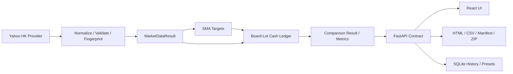

# QuantLab Architecture

## Product Boundary

QuantLab v0.2.1 is a reproducible Hong Kong stock and ETF daily-research prototype. The primary
runtime is local: a FastAPI backend serves a React frontend to an isolated browser application
window. It is not a brokerage gateway or multi-user trading service.

## Sources Of Truth

### Market facts

`MarketDataResult` owns normalized adjusted OHLC rows, requested and actual dates, warmup rows,
provider metadata, and the deterministic data SHA256. The engine never consumes raw provider
responses.

### Accounting facts

The HK comparison result owns the strategy and tradable-benchmark ledgers, trades, daily equity,
metrics, and cost totals. One cash-ledger implementation performs all fills. UI and export code
cannot create another accounting path.

### Presentation facts

The FastAPI serializer maps the completed result into a typed response. React, HTML, CSV, and
Manifest outputs consume that response; they do not recompute returns, drawdowns, trading costs,
or trade pairing.

## Runtime Boundaries

- **Network:** only the market-data provider crosses the external network boundary.
- **Pure domain:** normalization, fingerprinting, signals, execution, metrics, and serialization
  are deterministic for identical inputs.
- **Persistence:** SQLite stores local history, presets, settings, and cache metadata outside the
  source tree.
- **Frontend:** React Query owns server state; component state owns forms and navigation.
- **Desktop:** the launcher starts FastAPI, waits for HTTP readiness, opens an isolated Edge/Chrome
  profile, and performs bounded process-tree cleanup.
- **Export:** prepared files share one `run_id`; exporting does not rerun the provider or engine.

## Reproducibility

- Standardized prices use fixed column order, date format, float serialization, UTF-8, and LF
  before SHA256 calculation.
- The run ID includes stable configuration and data facts but excludes generation time.
- Golden tests use fixed literal expectations and never call production formulas to create
  `expected` values.
- Strategy and benchmark share the same execution discipline and explicit cost policy.

## Legacy Regression Boundary

The original SPY daily ledger, G01-G13 fixtures, and fixed v0.1.0 report remain in the repository
as regression assets. They protect established accounting behavior but are not the current React
product entry point.

See [BACKTEST_SPEC.md](BACKTEST_SPEC.md), [HK_MARKET_RULES.md](HK_MARKET_RULES.md),
[HK_GOLDEN_TESTS.md](HK_GOLDEN_TESTS.md), and
[FRONTEND_ARCHITECTURE.md](FRONTEND_ARCHITECTURE.md).
